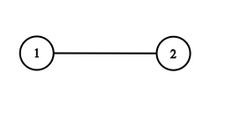

#### [133. 克隆图](https://leetcode-cn.com/problems/clone-graph/)

难度中等208收藏分享切换为英文关注反馈

给你无向 **[连通](https://baike.baidu.com/item/连通图/6460995?fr=aladdin)** 图中一个节点的引用，请你返回该图的 [**深拷贝**](https://baike.baidu.com/item/深拷贝/22785317?fr=aladdin)（克隆）。

图中的每个节点都包含它的值 `val`（`int`） 和其邻居的列表（`list[Node]`）。

```
class Node {
    public int val;
    public List<Node> neighbors;
}
```

 

**测试用例格式：**

简单起见，每个节点的值都和它的索引相同。例如，第一个节点值为 1（`val = 1`），第二个节点值为 2（`val = 2`），以此类推。该图在测试用例中使用邻接列表表示。

**邻接列表** 是用于表示有限图的无序列表的集合。每个列表都描述了图中节点的邻居集。

给定节点将始终是图中的第一个节点（值为 1）。你必须将 **给定节点的拷贝** 作为对克隆图的引用返回。

 

**示例 1：**


```
输入：adjList = [[2,4],[1,3],[2,4],[1,3]]
输出：[[2,4],[1,3],[2,4],[1,3]]
解释：
图中有 4 个节点。
节点 1 的值是 1，它有两个邻居：节点 2 和 4 。
节点 2 的值是 2，它有两个邻居：节点 1 和 3 。
节点 3 的值是 3，它有两个邻居：节点 2 和 4 。
节点 4 的值是 4，它有两个邻居：节点 1 和 3 。
```

**示例 2：**


```
输入：adjList = [[]]
输出：[[]]
解释：输入包含一个空列表。该图仅仅只有一个值为 1 的节点，它没有任何邻居。
```

**示例 3：**

```
输入：adjList = []
输出：[]
解释：这个图是空的，它不含任何节点。
```

**示例 4：**



```
输入：adjList = [[2],[1]]
输出：[[2],[1]]
```

 

**提示：**

1. 节点数不超过 100 。
2. 每个节点值 `Node.val` 都是唯一的，`1 <= Node.val <= 100`。
3. 无向图是一个[简单图](https://baike.baidu.com/item/简单图/1680528?fr=aladdin)，这意味着图中没有重复的边，也没有自环。
4. 由于图是无向的，如果节点 *p* 是节点 *q* 的邻居，那么节点 *q* 也必须是节点 *p* 的邻居。
5. 图是连通图，你可以从给定节点访问到所有节点。


**深度优先遍历**

克隆一张无向图，首先想到图遍历的两种方式，DFS和BFS，DFS以节点为主导，BFS以边为主导。以DFS为例子，每当遇到一个没有访问过的结点，就对其进行克隆$$clone()$$，并将其默认邻接表设为空。此后再遇到这个节点时，判断其是否已经访问过，判断是否访问过则可以用$$HashMap$$，键值对可以设成$$<orignalNode,cloneNode>$$,是否访问过可以通过查看表中是否有键为当前访问的原图$$node$$的键值对即可。


如果已经访问，直接返回对应的克隆节点。


如果没有访问过，克隆这个节点，默认邻接表设为空，键值对加入哈希表。并对原节点的邻接表所有节点进行遍历，递归更新这些节点的邻接表，最后返回对应的克隆节点，加入当前克隆节点的邻接表中。


**java**

```java
/*
// Definition for a Node.
class Node {
    public int val;
    public List<Node> neighbors;
    
    public Node() {
        val = 0;
        neighbors = new ArrayList<Node>();
    }
    
    public Node(int _val) {
        val = _val;
        neighbors = new ArrayList<Node>();
    }
    
    public Node(int _val, ArrayList<Node> _neighbors) {
        val = _val;
        neighbors = _neighbors;
    }
}
*/

class Solution {
    //<原图结点,克隆图对应结点>哈希表
    private HashMap <Node,Node>visited=new HashMap<>();
    public Node cloneGraph(Node node) {
        if(node==null)
            return node;
        //该节点已经访问,从哈希表中取出克隆结点返回
        else if(visited.containsKey(node))
            return visited.get(node);
        //本节点还未被访问过
        else{
            //对结点克隆,默认邻接列表设为空
            Node cloneNode=new Node(node.val,new ArrayList<>());
            //新生成的结点对存入哈希表
            visited.put(node,cloneNode);
            //对这个节点邻接结点进行遍历并更新其克隆节点的邻接表
            for(Node adjacentNode:node.neighbors){
                //对当前遍历的邻接结点
                cloneNode.neighbors.add(cloneGraph(adjacentNode));
            }
            return cloneNode;
        }
    }
}
```

