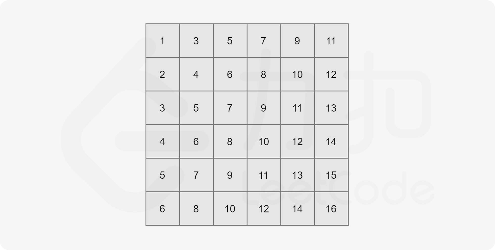

#### [378. 有序矩阵中第K小的元素](https://leetcode-cn.com/problems/kth-smallest-element-in-a-sorted-matrix/)


给定一个 $$n \times n$$ 矩阵，其中每行和每列元素均按升序排序，找到矩阵中第 `k` 小的元素。
请注意，它是排序后的第 `k` 小元素，而不是第 `k` 个不同的元素。

 

**示例：**

```
matrix = [
   [ 1,  5,  9],
   [10, 11, 13],
   [12, 13, 15]
],
k = 8,

返回 13。
```

容易想到将矩阵每行看作一个升序的数组，使用归并排序中调用的$$Merge()$$方法来两两合并数组，使用最小堆来进行优化，这样的时间复杂度是$$O(k\cdot log_2n),k\leq n^2$$

官方的最优解法:

**二分法**

设矩阵$$matrix[\quad][\quad]$$，矩阵的长宽均是$$n=matrix.length$$，根据题干的矩阵性质，可以得到：

最小的元素是$$Min=matrix[0][0]$$

最大的元素是$$Max=matrix[n-1][n-1]$$

假设目前要找的是第$$k$$小的数$$(1\leq k\leq n^2)$$，可以采用二分法寻找这个数字，先假设这个第$$k$$小的数字是$$mid=(Min+Max)/2$$，从矩阵的左下角元素$$matrix[n-1][0]$$开始，做一条分割线，由于每个元素小于其所有右下部分的元素，分割线将矩阵可以分割两个部分：左上部分、右下部份，让所有元素$$matrix[i][j]\leq mid$$的划归左上部分，大于的划归右下部分，并计算出左上部分的元素个数$$nums$$.



例如，对于这个矩阵，找第$$k$$小的元素，首先计算$$mid=(1+16)/2=8$$，从左下角元素开始，将所有小于等于8的元素划归上部分，大于的划归下部分.

**划分算法步骤**是：

1. 将当前元素初始化为$$Matrix[n-1][0],i=n-1,j=0$$
2. 如果到超过最后一列或者最上一行，跳转**5**，开始比较元素与$$mid$$的大小，如果小于等于$$mid$$，跳转**3**，否则跳转**4**
3. 说明当前元素及本**列**往上的所有元素均小于等于$$mid$$，$$nums+=(i+1)$$，由于行从0开始，所以本列往上的元素个数是$$i+1$$，并将元素移动为$$Matrix[i+1][j]$$（横向右移一个元素），跳转**2**
4. 说明当前元素大于$$mid$$，元素移动为$$Matrix[i-1][j]$$（竖直上移一个元素），跳转**2**
5. 返回$$nums$$，退出


初始将二分法的左右边界分别设置为$$left=Min,right=Max$$，进行划分，得到小于等于$$mid$$的元素个数$$nums $$.

1. $$nums\geq k$$

   说明当前小于等于$$mid$$的元素个数已经至少有了$$k$$个，目标数字元素必在这个部分，于是将右边界更新这个部分的最大值$$mid$$

2. $$nums<k$$

   说明小于等于$$mid$$的元素个数不足$$k$$个，目标数字元素必在另一个部分(右下部分)，于是左边界更新为右边部分的最小值$$mid+1$$

**java**

```java
class Solution {
    public int kthSmallest(int[][] matrix, int k) {
        int n=matrix.length;
        int Left=matrix[0][0];
        int Right=matrix[n-1][n-1];
        int mid=-1;
        while(Left<Right){
            mid=(Left+Right)/2;
            int nums=division(matrix,mid);
            if(nums>=k){
                Right=mid;
            }else{
                Left=mid+1;
            }
        }
        return Left;

    }
    public int division(int [][]matrix,int mid){
        int i=matrix.length-1;
        int j=0;
        int nums=0;
        while(i>=0&&j<matrix.length){
            if(matrix[i][j]<=mid){
                nums+= (i+1);
                j++;//边界线横右移
            }else{
                i--;//边界线上移
            }
        }
        return nums;
    }
}
```

