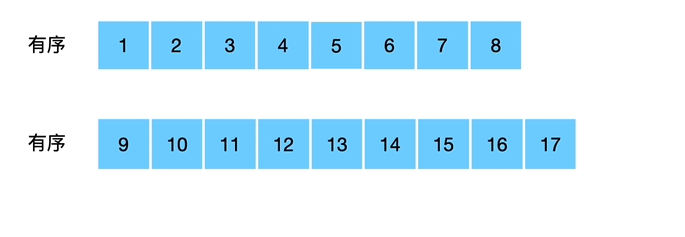
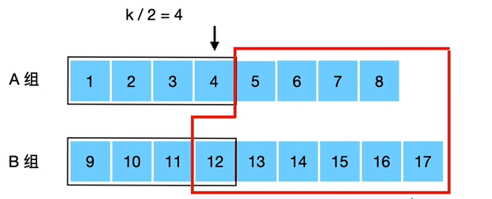
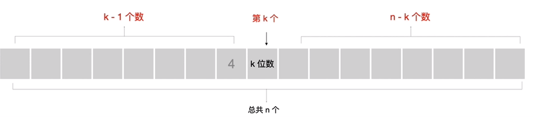

#### [4. 寻找两个正序数组的中位数](https://leetcode-cn.com/problems/median-of-two-sorted-arrays/)


给定两个大小为 m 和 n 的正序（从小到大）数组 `nums1` 和 `nums2`。

请你找出这两个正序数组的中位数，并且要求算法的时间复杂度为 $$O(log(m + n))$$。

你可以假设 `nums1` 和 `nums2` 不会同时为空。

 

**示例 1:**

```
nums1 = [1, 3]
nums2 = [2]

则中位数是 2.0
```

**示例 2:**

```
nums1 = [1, 2]
nums2 = [3, 4]

则中位数是 (2 + 3)/2 = 2.5
```

本题的难点在于如何设计一个时间复杂度仅为$$O(log_2(m+n))$$的算法来找到这个中位数，同时还要对每种边界情况进行合适的处理。

由于复杂度要求是$$log_2$$型，可以考虑二分法，先假设最简单的常规情况如下:



一共有17个元素，按照物理序号，则中位数是第$$17/2=8,Nums[8]$$元素，可以考虑用两个指针分别初始指向$$nums1[],nums2[]$$的首元素，然后指针分别尝试向后移动，分别指向自己的第$$8/2=4$$个元素(逻辑序号)；比较这两个数字的大小(这里是$$nums1[3],nums2[3]$$);其中更小的一个将自己的指针再后移一个，并"删除"掉前面的$$8/2=4$$个元素，另一个指针则回退回移动尝试前的位置，再进行**下一轮比较**。

**证明：上述过程删除的元素必全比要找的第k个数小**



这里删除的$$k/2$$个元素，若比要寻找的第k个数小，则等价于删除数序列最大的数(这里是$$4$$)，比第k个数小，则又等价于已知的比删除数序列最大的数大的数个数$$Length_{r}$$，要满足关系:

​			                                             	$$Length_r\geq n-(k-1)=n-k+1$$



根据图1，可以知道，$$nums2[]$$的指针在比较时尝试指向的元素12及之后的元素必大于等于$$nums1[]$$指针指向的元素4的，所以目前可以确定的大于等于待删除数序列(长度$$k/2 $$)中最大的数4的元素个数是:

​								   	$$Length_r=(length_1-k/2)+[length_2-(k/2-1)]=n-\lfloor \frac{k}{2}\rfloor\cdot2+1$$	

而显然有:

​		                                                            $$n-\lfloor \frac{k}{2}\rfloor\cdot2+1\geq n-k+1$$

所以删除的数字必全在要寻找的第$$target=k$$个数的左边

**继续迭代：**

删除了$$\lfloor \frac{k}{2}\rfloor$$个数，剩下的序列中，要找第k个数就成了第$$target=k-\lfloor \frac{k}{2}\rfloor=k_2$$个数，继续删除$$\lfloor \frac{k_2}{2}\rfloor$$个数，则要找的数还在剩下的两个数组中。直到$$\lfloor \frac{k_n}{2}\rfloor=0$$,统计目前已经删除的数的个数，要找的第$$target$$数的下标就成了：

​				                                        	$$target_{now}=target-\sum DeleteNums$$

如果$$target_{now}\equiv0$$，说明已经删除完毕，当前两个数组的指针指向的数中更小的一个(也就是剩下的所有数字中最小的一个)就是要找的数(因为是第0个)，如果中位数是两个数求平均，再找第二小的一个即可。

否则，则建立一个临时数组$$tmparray[\quad]$$，为了方便求解中位数平均的情况，$$tmparray[\quad]$$要存放到$$Remain[target_{now}+1]$$，因此长度是$$target_{now}+2$$,从两个指针处开始不断比较取当前最小的元素存入$$tmparray[\quad]$$数组，直到元素个数足够。

**特殊情况：**

其中一个数组可能出现元素越界的情况，**在指针移动时，当前尝试移动量越过了数组的边界**，此时指针保持不变，仅移动另一个数组的指针。那么结果会有两种情况:

1. 删除的元素在另一个数组中，正确执行，另一个数组的指针移动，本数组指针仍然保持不变，进入下一个尝试
2. 删除的元素在本数组中，**说明本数组所有元素都小于中位数，**数组指针移动至`nums.length`，表明越界，用本数组能够删除的元素个数更新$$target$$,退出尝试循环，直接在另一个数组中从指针处开始查找$$nums[target],nums[target+1]$$

如果一个数组为空，直接在另一个数组中根据中位数序号和数组长度寻找即可.

**起始：**

$$(1):\qquad L=(length_1+length_2)\%2\equiv0 $$

总共偶数个元素，按照物理序号，则$$Nums[\frac{L}{2}-1],Nums[\frac{L}{2}]$$为寻找的数，可以设$$target=k=(\frac{L}{2}-1)$$

找到后再往后找一个，求平均.

$$(2):\qquad L=(length_1+length_2)\%2\equiv1 $$

总共奇数个元素，按照物理序号，则$$Nums[\lfloor \frac{L}{2}\rfloor]$$为寻找的数，设$$target=k=\lfloor \frac{L}{2}\rfloor$$即为所求.

**java:**

```java
class Solution {
    public double findMedianSortedArrays(int[] nums1, int[] nums2) {
        if(nums1.length==0){
            if(nums2.length%2==0){
                return (nums2[nums2.length/2]+nums2[nums2.length/2-1])/2.0;
            }else{
                return nums2[nums2.length/2];
            }
        }
        if(nums2.length==0){
            if(nums1.length%2==0){
                return (nums1[nums1.length/2]+nums1[nums1.length/2-1])/2.0;
            }else{
                return nums1[nums1.length/2];
            }
        }
        boolean odd_or_even;//true->odd,false->even
        if((nums1.length+nums2.length)%2==1){
            odd_or_even=true;
        }else{
            odd_or_even=false;
        }
        int point1=0,point2=0;
        int mid=(nums1.length+nums2.length)/2;
        if(!odd_or_even)
            mid=mid-1;
        int target=mid;
        //We need to find NUMS[mid]
        int tmp=target/2;
        int tmppoint1,tmppoint2;
        while(tmp>0&&point1<nums1.length&&point2<nums2.length){
            if(point1+tmp-1<nums1.length){
                tmppoint1=point1+tmp-1;
            }else{
                tmppoint1=point1;
            }

            if(point2+tmp-1<nums2.length){
                tmppoint2=point2+tmp-1;
            }else{
                tmppoint2=point2;
            }

            if(nums1[tmppoint1]<=nums2[tmppoint2]){
                target=target-(tmppoint1+1-point1);
                point1=tmppoint1+1;
            }else{
                target=target-(tmppoint2+1-point2);
                point2=tmppoint2+1;
            }
            tmp=target/2;
        }
        //boolean NoOverflow=false;
        int tmpresult[]=new int [2];
        if(point1>=nums1.length){
            tmpresult[0]=nums2[point2+target];
            tmpresult[1]=nums2[point2+target+1];
        }else if(point2>=nums2.length){
            tmpresult[0]=nums1[point1+target];
            tmpresult[1]=nums1[point1+target+1];
        }else{
            int tmparray[]=new int [target+2];
            int j=0;
            while(j<target+2){
                if(point1<nums1.length&&point2<nums2.length){
                    if(nums1[point1]<=nums2[point2]){
                        tmparray[j]=nums1[point1];
                        point1++;
                    }else{
                        tmparray[j]=nums2[point2];
                        point2++;
                    }
                }else if(point1<nums1.length){
                    tmparray[j]=nums1[point1];
                    point1++;
                }else{
                    tmparray[j]=nums2[point2];
                    point2++;
                }
                j++;
            } 
            tmpresult[0]=tmparray[target];
            tmpresult[1]=tmparray[target+1];
            //NoOverflow=true;
        }
        if(odd_or_even){//odd
            return Math.min(tmpresult[0],tmpresult[1]);      
        }
        else{//even
            return (tmpresult[0]+tmpresult[1])/2.0;
        }
    }
}
```


