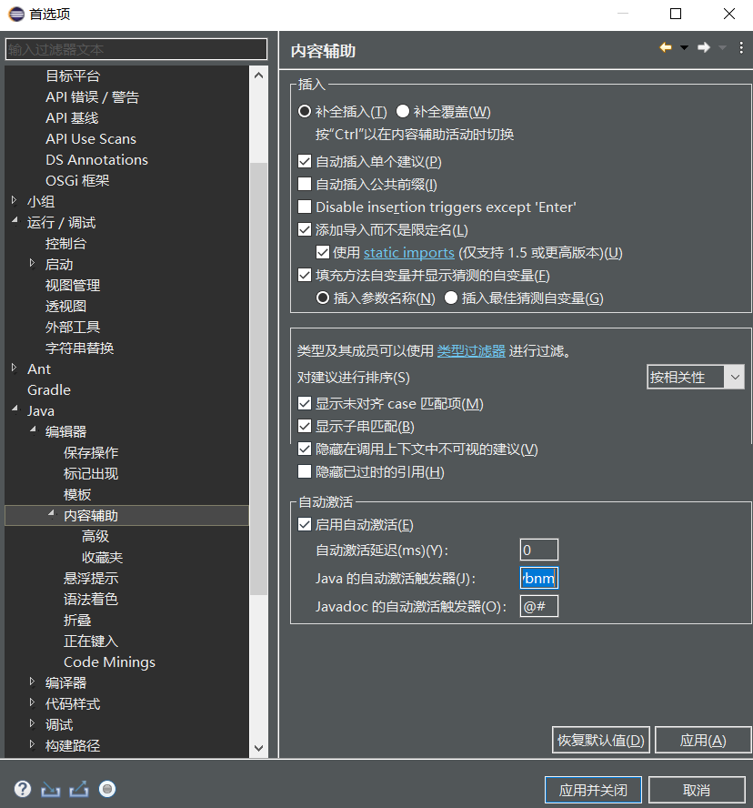
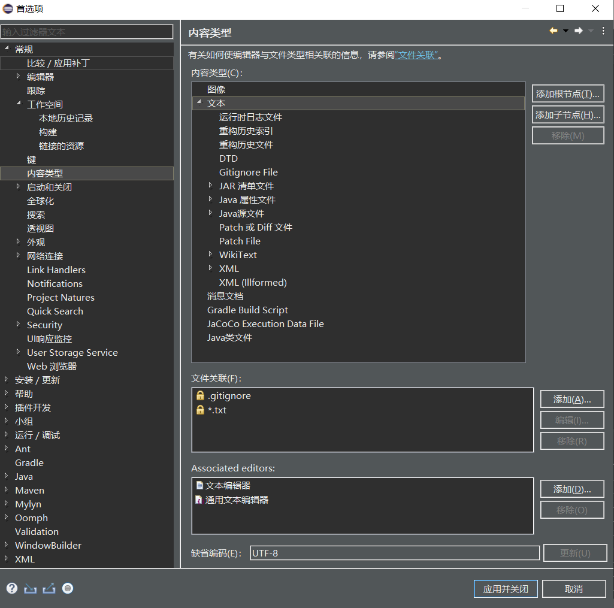
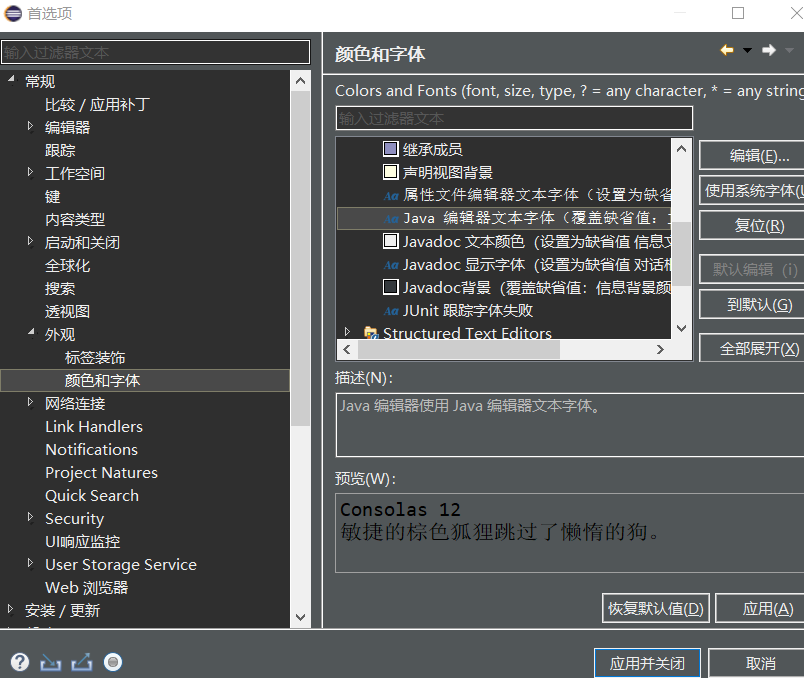

#### java读取输入

```java
import java.util.Scanner;

public class problem1{
    public static void main(String[]args){
        Scanner scan=new Scanner(System.in);
        int n=scan.nextInt();
        scan.nextLine();
        int []w=new int [n];
        int []score=new int [n];
        for(int i=0;i<n;i++){
            w[i]=scan.nextInt();
            score[i]=scan.nextInt();
            scan.nextLine();
        }
        int res=0;
        for(int i=0;i<n;i++){
            res+=w[i]*score[i];
        }
        if(res<0)
            res=0;
        System.out.println(res);
    }
}
```

`nextLine()`方法会读取一行，包括空格，并吃掉回车换行符但是并不将其写入结果字符串中。`nextInt`则只会把下一个空格分词尝试转为int，但是不吃回车，需要用`nextLine()`再读一次

**文件测试**

```java
import java.io.FileNotFoundException; 
Scanner scan=null;
        try {
            scan = new Scanner(new File("input.txt"));
        } catch (FileNotFoundException e) {
            // TODO Auto-generated catch block
            e.printStackTrace();
        }
```

```java
import java.io.File;
import java.io.FileNotFoundException;
import java.util.ArrayList;
import java.util.Scanner;

class Point{
    int x;
    int y;
    public Point(int x,int y){
        this.x=x;
        this.y=y;
    }
}

public class problem19_2 {
    
    public static void main(String[]args){
        StringBuffer ans=new StringBuffer();
        //Scanner scan=new Scanner(System.in);
        Scanner scan=null;
        try {
            scan = new Scanner(new File("input.txt"));
        } catch (FileNotFoundException e) {
            // TODO Auto-generated catch block
            e.printStackTrace();
        }
        
        int n=scan.nextInt();
        int m=scan.nextInt();
        scan.nextLine();

        //System.out.println("n="+n+" m="+m);

        ArrayList<Point> aSet=new ArrayList<>();
        ArrayList<Point> bSet=new ArrayList<>();

        for(int i=0;i<n;i++){
            int x=scan.nextInt();
            int y=scan.nextInt();
            String id=scan.nextLine().trim();
            if(id.equals("A")){
                aSet.add(new Point(x, y));
                //System.out.println("A:"+x+","+y);
            }else{
                bSet.add(new Point(x, y));
                //System.out.println("B:"+x+","+y);
            }
        }


        for(int i=0;i<m;i++){
            int C=scan.nextInt();
            int A=scan.nextInt();
            int B=scan.nextInt();
            if(scan.hasNextLine())
                scan.nextLine();
            //System.out.println("A="+A+" B="+B+" C="+C);
            Point tmpA=aSet.get(0);
            Point tmpB=bSet.get(0);
            boolean aSetCondition;
            boolean bSetCondition;

            if(A*tmpA.x+B*tmpA.y+C>0){
                aSetCondition=true;
                if(A*tmpB.x+B*tmpB.y+C<0){
                    bSetCondition=false;
                }else{
                    ans.append("No\n");
                    continue;
                }
            }else{
                aSetCondition=false;
                if(A*tmpB.x+B*tmpB.y+C>0){
                    bSetCondition=true;
                }else{
                    ans.append("No\n");
                    continue;
                }
            }

            boolean finish=false;

            for(int j=1;j<aSet.size();j++){
                tmpA=aSet.get(j);
                if(A*tmpA.x+B*tmpA.y+C>0){
                    if(!aSetCondition){
                        finish=true;
                        ans.append("No\n");
                        break;
                    }
                }else{
                    if(aSetCondition){
                        finish=true;
                        ans.append("No\n");
                        break;
                    }
                }

            }
            if(!finish){
                for(int j=1;j<bSet.size();j++){
                    tmpB=bSet.get(j);
                    if(A*tmpB.x+B*tmpB.y+C>0){
                        if(!bSetCondition){
                            finish=true;
                            ans.append("No\n");
                            break;
                        }
                    }else{
                        if(bSetCondition){
                            finish=true;
                            ans.append("No\n");
                            break;
                        }
                    }
                }    
            }
            if(!finish){
                ans.append("Yes\n");
            }
        }

        System.out.print(ans.toString());

    }
}
```


**字符串相等**

使用`.equals("???")`匹配

#### next() 与 nextLine() 区别

`next()`:

- 1、一定要读取到有效字符后才可以结束输入。
- 2、对输入有效字符之前遇到的空白，next() 方法会自动将其去掉。
- 3、只有输入有效字符后才将其后面输入的空白作为分隔符或者结束符。
- next() 不能得到带有空格的字符串。

`nextLine()`：

- 1、以Enter为结束符,也就是说 `nextLine()`方法返回的是输入回车之前的所有字符。
- 2、可以获得空白。

**分割**

`String.split()`用于分割字符串，`String[] arr=str.split("\\s+")`可以用一个或多个空格分割字符串。

**String转int**

`Integer.parseInt(str)`

**int转String**

`String.valueOf(num)`，`Integer.toString(num)`

**自动机**


```java
import java.util.regex.*;
 
class Solution {
    enum State{
        STATE_START,
        STATE_SIGNED,
        STATE_IS_NUMBER,
        STATE_MAYBE_SNNUMBER,
        STATE_IS_SNNUMBER,
        STATE_MAYBE_FLOATNUMBER,
        STATE_IS_FLOATNUMBER,
        STATE_NONUMBER,
    };

    enum CharType{
        CHAR_SIGN,
        CHAR_EXP,
        CHAR_POINT,
        CHAR_NUMBER,
        CHAR_OTHER,
    }

    public boolean isNumber(String s) {
        s=s.trim();
        if(s.equals(".")||s.equals("+.")||s.equals("-."))
            return false;
        if(Pattern.matches("\\.[e|E][0-9]*", s))
            return false;
        Map<State,Map<CharType,State>>Automaton=new HashMap<>();
        Map<CharType,State>start=new HashMap<>(){{
            put(CharType.CHAR_POINT,State.STATE_MAYBE_FLOATNUMBER);
            put(CharType.CHAR_SIGN,State.STATE_SIGNED);
            put(CharType.CHAR_NUMBER,State.STATE_IS_NUMBER);
            put(CharType.CHAR_OTHER,State.STATE_NONUMBER);
        }};

        Map<CharType,State>signed=new HashMap<>(){{
            put(CharType.CHAR_NUMBER,State.STATE_IS_NUMBER);
            put(CharType.CHAR_OTHER,State.STATE_NONUMBER);
            put(CharType.CHAR_POINT,State.STATE_MAYBE_FLOATNUMBER);
        }};

        Map<CharType,State>is_number=new HashMap<>(){{
            put(CharType.CHAR_EXP,State.STATE_MAYBE_SNNUMBER);
            put(CharType.CHAR_POINT,State.STATE_MAYBE_FLOATNUMBER);
            put(CharType.CHAR_NUMBER,State.STATE_IS_NUMBER);
            put(CharType.CHAR_OTHER,State.STATE_NONUMBER);
        }};

        Map<CharType,State>maybe_SNnumber=new HashMap<>(){{
            put(CharType.CHAR_NUMBER,State.STATE_IS_SNNUMBER);
            put(CharType.CHAR_SIGN,State.STATE_MAYBE_SNNUMBER); 
            put(CharType.CHAR_OTHER,State.STATE_NONUMBER);
        }};

        Map<CharType,State>is_SNnumber=new HashMap<>(){{
            put(CharType.CHAR_NUMBER,State.STATE_IS_SNNUMBER);
            put(CharType.CHAR_OTHER,State.STATE_NONUMBER);
        }};

        Map<CharType,State>maybe_FloatNumber=new HashMap<>(){{
            put(CharType.CHAR_NUMBER,State.STATE_IS_FLOATNUMBER);
            put(CharType.CHAR_OTHER,State.STATE_NONUMBER);
            put(CharType.CHAR_EXP,State.STATE_MAYBE_SNNUMBER);
        }};

        Map<CharType,State>is_FloatNumber=new HashMap<>(){{
            put(CharType.CHAR_EXP,State.STATE_MAYBE_SNNUMBER);
            put(CharType.CHAR_NUMBER,State.STATE_IS_FLOATNUMBER);
            put(CharType.CHAR_OTHER,State.STATE_NONUMBER);
        }};

        Automaton.put(State.STATE_START,start);
        Automaton.put(State.STATE_SIGNED,signed);
        Automaton.put(State.STATE_IS_NUMBER,is_number);
        Automaton.put(State.STATE_MAYBE_SNNUMBER,maybe_SNnumber);
        Automaton.put(State.STATE_MAYBE_FLOATNUMBER,maybe_FloatNumber);
        Automaton.put(State.STATE_IS_SNNUMBER,is_SNnumber);
        Automaton.put(State.STATE_IS_FLOATNUMBER,is_FloatNumber);

        State curState=State.STATE_START;

        for(int i=0;i<s.length();i++){
            char ch=s.charAt(i);
            CharType type=toCharType(ch);
            if(Automaton.get(curState).containsKey(type)){
                curState=Automaton.get(curState).get(type);
            }else{
                return false;
            }
            if(curState==State.STATE_NONUMBER)
                return false;
        }
        if(curState==State.STATE_IS_FLOATNUMBER||curState==State.STATE_IS_NUMBER||curState==State.STATE_IS_SNNUMBER||curState==State.STATE_MAYBE_FLOATNUMBER)
            return true;
        return false;
    }

    public CharType toCharType(char ch){
        if(ch<='9'&&ch>='0')
            return CharType.CHAR_NUMBER;
        if(ch=='E'||ch=='e')
            return CharType.CHAR_EXP;
        if(ch=='.')
            return CharType.CHAR_POINT;
        if(ch=='+'||ch=='-')
            return CharType.CHAR_SIGN;
        return CharType.CHAR_OTHER;
    }
}
```


```java
class Solution {
    public int myAtoi(String s) {
        //s=s.trim();
        Automaton automaton=new Automaton();
        for(int i=0;i<s.length();i++){
            automaton.parser(s.charAt(i));
        }
        return (int)(automaton.sign*automaton.ans);
    }
}

class Automaton{
    public int sign = 1;
    public long ans = 0;
    private String state = "start";

    private Map<String,String[]>table=new HashMap<>(){{
        put("start",new String[]{"start","signed","in_number","end"}); // 空格 、 +/- 、 number 、 other
        put("signed",new String[]{"end","end","in_number","end"});
        put("in_number",new String[]{"end","end","in_number","end"});
        put("end",new String[]{"end","end","end","end"});
    }};

    public void parser(char c){
        state=table.get(state)[getNextState(c)];
        switch(state){
            case "start":
                break;
            case "end":
                break;
            case "in_number":
                ans=ans*10+c-'0';
                ans = sign == 1 ? Math.min(ans, (long) Integer.MAX_VALUE) : Math.min(ans, -(long) Integer.MIN_VALUE);
                break;
            case "signed":
                sign = c=='+'?1:-1;
                break;
        }
    }

    private int getNextState(char c){
        if(c==' ')
            return 0;
        if(c=='+'||c=='-')
            return 1;
        if(Character.isDigit(c))
           return 2;
        return 3;
    }
}
```

#### eclipse

内容辅助



`.qwertyuiopasdfghjklzxcvbnm`

UTF-8



字体

